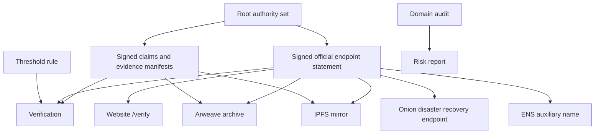

# OrgAnchor Architecture

## 架构目标

OrgAnchor 的架构目标是把“组织身份连续性”拆成清晰、可测试、可验证的工程层次。

核心判断：

> 组织根权威负责身份连续性，签名声明负责当前入口可信性，外部承载体负责发布、归档、镜像、灾备和辅助发现。

## 分层模型



OrgAnchor 分为六层：

1. 身份层：组织根权威、根成员密钥和阈值规则。
2. 声明层：官方入口声明、迁移声明、签名和验证。
3. 证据层：产品/服务声明、证据清单、artifact hash 和 provenance。
4. 承载层：官网、Arweave、IPFS、Onion、ENS。
5. 审计层：传统域名安全审计。
6. 状态层：`organchor.config.json` 和 `organchor.lock.json`。

## 信任模型

OrgAnchor 中只有一个身份根：

```text
organization root authority
```

当前官方入口的可信性来自：

```text
canonical JSON statement + supported signatures + known root authority rule
```

Arweave、IPFS、Onion、ENS、官网和 GitHub 都不能单独证明组织身份。它们只能承载或指向已经签名的声明。

产品/服务声明和证据清单也不能自动证明产品效用真实。它们证明的是：组织发布过这些声明，列出了这些证据，证据 artifact 与记录的 hash 一致，证据链可被人和 AI agent 检查。

## 组织根权威

OrgAnchor 的根权威是：

```text
一组根公钥 + 一条阈值规则 + 可追溯的变更历史
```

最小组织可以使用 `1-of-1`：

```json
{
  "root_authority": {
    "id": "root-authority-2026",
    "threshold": {
      "required": 1,
      "total": 1
    },
    "keys": [
      {
        "id": "root-2026",
        "algorithm": "ed25519",
        "public_key": "BASE64URL_PUBLIC_KEY"
      }
    ]
  }
}
```

成熟组织可以迁移到 `2-of-3`、`3-of-5` 或更高阈值：

```json
{
  "root_authority": {
    "id": "root-authority-2027",
    "threshold": {
      "required": 2,
      "total": 3
    },
    "keys": [
      { "id": "alice-2027", "algorithm": "ed25519", "public_key": "..." },
      { "id": "bob-2027", "algorithm": "ed25519", "public_key": "..." },
      { "id": "carol-2027", "algorithm": "ed25519", "public_key": "..." }
    ]
  }
}
```

关键原则：

- 不推荐多人共享同一个根私钥。
- 每个根成员应持有自己的私钥。
- 声明验证应检查签名集合是否满足阈值规则。
- 根权威变化必须通过迁移声明或根权威变更声明连接旧历史。
- v1 可以先实现 `1-of-1`，但 schema 和签名文件应预留多签结构。

## 推荐技术决策

密码学选择必须遵守 `CRYPTO_POLICY.md`。本节只记录当前推荐技术栈，不能把当前算法误写成永久身份根。

完整技术选择、风险、替换路径和依据见 `TECHNICAL_DECISIONS.md`。

产品声明与证据链设计见 `EVIDENCE_MODEL.md`。

### 1. TypeScript + Node.js

理由：

- 适合 CLI。
- 适合 npm 发布。
- 适合未来把验证逻辑共享给浏览器端 verify 页面。
- 生态成熟，便于接入 DNS、HTTP、ENS、IPFS、Arweave 等模块。

### 2. Ed25519 and Algorithm Agility

用途：

- 根成员密钥签署官方入口声明。
- 根成员密钥签署迁移声明。

Ed25519 是 v1 默认算法，理由：

- 成熟、常用、签名短、速度快。
- Node.js 原生 crypto 支持 Ed25519。
- 不需要自行实现底层密码学。

但 OrgAnchor 不应把 Ed25519 当成永久身份根。身份根是组织根权威，算法只是根权威成员密钥的一种实现。

所有 key 和 signature 必须包含明确的 `algorithm` 字段。验证器遇到不支持的算法必须 fail closed。

未来可通过迁移声明或混合根权威引入后量子签名，例如 ML-DSA 或 SLH-DSA。

### 3. Canonical JSON

用途：

- 签名前把 JSON 转换为确定性表示。
- 确保同一语义 JSON 即使字段顺序不同，也得到相同 hash 和签名验证结果。

推荐：

```text
RFC 8785 JSON Canonicalization Scheme
```

### 4. SHA-256

用途：

- 对 canonical JSON 计算声明 hash。
- 对发布到 Arweave、IPFS 的内容做本地和远端一致性验证。

### 5. 独立签名文件

声明文件：

```text
statements/official-endpoints.json
```

签名文件：

```text
statements/official-endpoints.json.sig
```

推荐签名文件结构：

```json
{
  "type": "OrgAnchorSignature",
  "version": "1.0",
  "canonicalization": "RFC8785-JCS",
  "hash": {
    "algorithm": "sha256",
    "value": "BASE64URL_OR_HEX_HASH"
  },
  "signatures": [
    {
      "key_id": "root-2026",
      "algorithm": "ed25519",
      "signature": "BASE64URL_SIGNATURE",
      "signed_at": "2026-05-08T00:00:00Z"
    }
  ]
}
```

`1-of-1` 时只有一个签名。多根权威时，签名文件可以包含多个独立签名，验证器根据声明中的根权威规则判断是否满足阈值。

## 关于 archive 字段和 lockfile 的关键设计

需求中希望把 Arweave TX 和 IPFS CID 回写到 `official-endpoints.json` 的 `archives` 字段。

这里有一个重要递归问题：

1. 先签名声明。
2. 上传声明后得到 Arweave TX 或 IPFS CID。
3. 如果把 TX 或 CID 写回声明，声明内容变化。
4. 内容变化后 hash 和签名变化。
5. 重新上传后 TX 或 CID 又变化。

因此推荐 v1 采用以下规则：

### `official-endpoints.json`

保存组织希望公开声明的当前官方入口和辅助归档入口。

可以包含：

- 上一轮归档记录。
- verify 页面入口。
- 公开展示用的 Arweave 或 IPFS 引用。
- 当前推荐访问入口。

但不强制包含“自身最终发布后的 TX 或 CID”。

### `organchor.lock.json`

保存精确发布结果。

示例：

```json
{
  "version": "1.0",
  "statements": [
    {
      "statement_path": "statements/official-endpoints.json",
      "statement_hash": "sha256:...",
      "signature_path": "statements/official-endpoints.json.sig",
      "published_at": "2026-05-08T00:00:00Z",
      "arweave": [
        {
          "kind": "statement",
          "tx_id": "...",
          "hash": "sha256:..."
        }
      ],
      "ipfs": [
        {
          "kind": "verify-page",
          "cid": "...",
          "hash": "sha256:..."
        }
      ]
    }
  ]
}
```

这样可以避免自引用发布循环，同时保留完整可追溯发布记录。

## 数据文件

OrgAnchor v1 生成这些核心文件：

```text
organchor.config.json
organchor.lock.json
keys/root-2026.private.json
keys/root-2026.public.json
statements/official-endpoints.json
statements/official-endpoints.json.sig
statements/migration-*.json
statements/migration-*.json.sig
claims/product-claims.json
claims/product-claims.json.sig
evidence/evidence-manifest.json
evidence/evidence-manifest.json.sig
public/verify/index.html
public/verify/official-endpoints.json
public/verify/official-endpoints.json.sig
public/verify/root.public.json
reports/domain-security-report.json
reports/domain-security-report.md
```

## 配置文件职责

`organchor.config.json` 保存用户配置。

它可以包括：

- 组织名称。
- 显示名称。
- 简介。
- 主域名。
- 官方入口。
- 默认 root authority id。
- 默认 root key id。
- 默认输出目录。
- Arweave provider 配置引用。
- IPFS provider 配置引用。
- ENS 名称。
- Onion 地址。

它不应该保存私钥、钱包助记词、API token 或敏感凭证。

## Lockfile 职责

`organchor.lock.json` 保存发布和验证结果。

它可以包括：

- 声明 hash。
- 签名 hash。
- 公钥 hash。
- Arweave TX。
- IPFS CID。
- 发布时间。
- provider 名称。
- verify 结果。
- domain audit 快照。

它不是身份根，但它是重要的状态记录。

## 模块设计

### core

负责纯逻辑：

- canonical JSON。
- SHA-256 hash。
- schema validation。
- lockfile 读写。
- 错误类型。
- 路径和文件安全检查。

### crypto

负责密钥和签名：

- Ed25519 key generation。
- private key 保存。
- public key 导出。
- root authority set 生成和验证。
- statement signing。
- signature verification。

不自行实现 Ed25519 算法。

### schema

负责 JSON Schema：

- `official-endpoints.schema.json`
- `migration.schema.json`

schema 是声明格式稳定性的核心。

### commands

负责 CLI 命令：

```text
init
key generate
key public
key rotate-plan
statement create
statement sign
statement verify
statement hash
page generate
archive arweave publish
archive arweave verify
mirror ipfs publish
mirror ipfs verify
onion init
onion config generate
onion verify
domain audit
ens inspect
ens plan
ens verify
ens apply
migrate create
migrate sign
migrate verify
```

### publishers

负责外部发布：

- Arweave provider。
- IPFS provider。
- 未来可能的 GitHub Pages 或静态站点 provider。

所有发布操作必须输出 hash 和可验证 receipt，并写入 lockfile。

### auditors

负责域名安全审计：

- DNSSEC。
- SPF。
- DKIM。
- DMARC。
- MX。
- CAA。
- HTTPS。
- TLS certificate expiry。
- security.txt。
- `/verify`。
- statement 和 signature 可访问性。
- 域名过期时间，如可查询。
- Registry Lock 和自动续费人工检查项。

### auxiliary-names

负责 ENS：

- inspect。
- plan。
- verify。
- 可选 apply。

ENS 模块必须始终强调：ENS 是辅助名称，不是身份根。

### onion

负责 Onion 灾备入口：

- onion v3 地址格式校验。
- Tor Hidden Service 配置片段生成。
- verify 页面部署说明。
- 声明绑定说明。

OrgAnchor 不运行 Tor，也不保证 onion 服务在线。

### page

负责静态验证页：

- 生成 `public/verify/index.html`。
- 复制 statement、signature、root authority record。
- 展示组织信息、官方入口、hash、key id、发布时间。
- 支持人类查看。
- 尽量支持浏览器端机器验证。

## 建议目录结构

```text
organchor/
  package.json
  tsconfig.json
  src/
    cli.ts
    core/
      canonicalize.ts
      hash.ts
      errors.ts
      lockfile.ts
    crypto/
      ed25519.ts
      algorithms.ts
      signature.ts
    schema/
      official-endpoints.schema.json
      migration.schema.json
    commands/
      init.ts
      key-generate.ts
      key-public.ts
      statement-create.ts
      statement-sign.ts
      statement-verify.ts
      page-generate.ts
      claims-create.ts
      claims-sign.ts
      claims-verify.ts
      evidence-create.ts
      evidence-add.ts
      evidence-sign.ts
      evidence-verify.ts
      arweave-publish.ts
      arweave-verify.ts
      ipfs-publish.ts
      ipfs-verify.ts
      onion-init.ts
      onion-config-generate.ts
      domain-audit.ts
      ens-inspect.ts
      ens-plan.ts
      ens-verify.ts
      migrate-create.ts
      migrate-sign.ts
      migrate-verify.ts
    publishers/
      arweave.ts
      ipfs.ts
    auditors/
      domain.ts
      dnssec.ts
      email-auth.ts
      https.ts
      security-txt.ts
    auxiliary-names/
      ens.ts
    onion/
      config.ts
      validate.ts
    page/
      template.ts
    evidence/
      claims.ts
      manifest.ts
    types/
      statement.ts
      migration.ts
      evidence.ts
      lockfile.ts
      report.ts
  tests/
    canonicalize.test.ts
    sign-verify.test.ts
    evidence.test.ts
    statement-schema.test.ts
    migration.test.ts
    arweave.test.ts
    ipfs.test.ts
    domain-audit.test.ts
    ens.test.ts
    onion.test.ts
  examples/
    complete/
```

## CLI 行为原则

CLI 应该满足：

- 默认安全。
- 输出明确。
- 失败时说明原因。
- 所有 publish 操作支持 dry-run。
- 所有外部结果写入 lockfile。
- 不把人工检查项伪装成自动结果。
- 不把 ENS、IPFS、Arweave、Onion 宣传成身份根。

示例输出状态：

```text
PASS
WARN
FAIL
MANUAL_CHECK_REQUIRED
```

## v1 实施顺序

### 阶段 1：身份核心

目标：

- 项目初始化。
- CLI 框架。
- key generate。
- key public。
- statement create。
- statement hash。
- statement sign。
- statement verify。
- schema validation。

这一阶段完成后，OrgAnchor 已经不是概念，而是一个可验证声明工具。

### 阶段 2：静态验证页

目标：

- page generate。
- 生成 `public/verify/index.html`。
- 复制声明、签名和公钥。
- 页面展示验证信息。

这一阶段完成后，组织可以把 verify 页面发布到传统官网。

### 阶段 3：IPFS、Arweave 和证据清单

目标：

- IPFS dry-run。
- 本地 Kubo publish。
- IPFS verify。
- Arweave dry-run/manual package。
- Arweave publish provider。
- Arweave verify。
- claims/product-claims.json。
- evidence/evidence-manifest.json。
- claims/evidence 签名和验证。
- AI-agent-friendly 证据链结构。
- `organchor.lock.json` 发布结果记录。

这一阶段完成后，声明和证据清单可以被镜像和归档，OrgAnchor 可以拿自身作为第一个公开试点。

### 阶段 4：Onion、domain audit、ENS

目标：

- onion 地址校验。
- Tor Hidden Service 配置生成。
- domain audit 报告。
- ENS inspect、plan、verify。

这一阶段完成后，OrgAnchor 覆盖现实入口、灾备入口和辅助名称。

### 阶段 5：迁移声明

目标：

- migrate create。
- migrate sign。
- migrate verify。
- key rotate-plan。

这一阶段完成后，OrgAnchor 支持未来入口迁移和密钥轮换。

## 测试策略

核心测试：

- 同一 JSON 不同字段顺序，canonical hash 一致。
- 任意字段被修改，签名验证失败。
- 错误公钥验证失败。
- 签名数量或签名者集合不满足根权威阈值时验证失败。
- 缺少必填字段验证失败。
- 私钥文件默认被 `.gitignore` 忽略。
- Arweave TX 内容 hash 与本地不一致时失败。
- IPFS CID 内容 hash 与本地不一致时失败。
- ENS 记录与声明不一致时失败。
- onion 地址格式错误时失败。
- domain audit 输出 `PASS`、`WARN`、`FAIL`、`MANUAL_CHECK_REQUIRED`。

## 安全约束

必须遵守：

- 不自行实现底层密码学算法。
- 签名前必须 canonicalize JSON。
- 声明 hash 使用 SHA-256。
- 私钥默认不提交 Git。
- 私钥文件创建时设置合理权限。
- publish 操作必须输出 hash 和可验证结果。
- 外部发布结果必须写入 `organchor.lock.json`。
- 核心依赖许可证必须清晰。

## 早期开放问题

这些问题不阻塞第一阶段实现，但需要在接入外部 provider 前确定：

1. Arweave 首个真实上传适配器选 Turbo、Irys，还是先只做 manual package。
2. IPFS v1 是否先只支持本地 Kubo，再支持 pinning provider。
3. `/verify` 页面是否必须完全离线验证签名，还是 v1 先展示并提供 CLI 验证说明。
4. 根私钥格式采用 Node JWK、PKCS8 PEM，还是 OrgAnchor 自定义 JSON 包装格式。
5. schema URL 是否先使用 `https://organchor.org/schemas/...`，即使官网尚未上线。

推荐默认答案：

- Arweave：先做 dry-run/manual package，然后接一个成熟 provider。
- IPFS：先支持本地 Kubo。
- verify 页面：v1 生成人类可读页面，并逐步加入浏览器端验签。
- 私钥格式：使用成熟标准格式外包在 OrgAnchor JSON 容器中，避免裸私钥难以识别。
- schema URL：保留目标 URL，同时在 npm 包内包含本地 schema。
