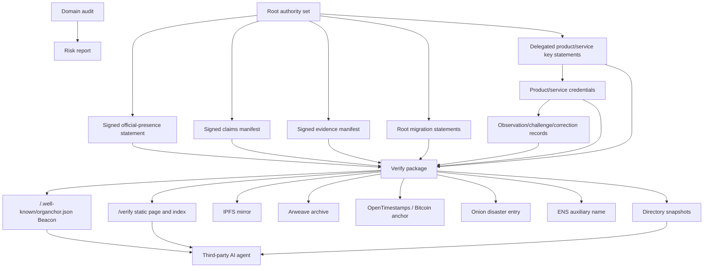

# OrgAnchor Architecture

Status: Accepted baseline, actively implemented

OrgAnchor helps organizations publish signed identity, official-presence, and value-evidence records so their online presence can remain discoverable, verifiable, and understandable across domain, platform, infrastructure, and discovery-channel changes.

OrgAnchor is not a trust oracle. It does not decide whether an organization is good, safe, lawful, or the best supplier for a given need. It creates a low-friction verification substrate that humans, organizations, directories, and AI agents can use as input to their own policies.

## Design Goal

The architecture optimizes for five properties:

1. Identity continuity: a current statement must trace back to an organization-controlled root authority.
2. Carrier independence: websites, domains, IPFS, Arweave, ENS, GitHub, and onion services can carry artifacts, but none of them is the identity root.
3. Agent readability: a third-party AI agent should find the verification entrypoint, verify signatures and hashes, inspect value evidence, and understand remaining gaps with minimal custom logic.
4. Discovery without capture: central directories can accelerate discovery, but any adopter should also expose enough first-party signals to be found directly.
5. Evolvability: cryptography, root authority membership, carriers, evidence profiles, and discovery methods must be replaceable without rewriting the identity history.

## Layer Model



## Trust Model

There is one identity root:

```text
organization root authority
```

The root authority is not necessarily one key. It is:

```text
root public keys + threshold rule + signed migration history
```

Small organizations can start with `1-of-1`. Growing organizations should migrate to `2-of-3`, `3-of-5`, or another policy that matches their governance and key-custody maturity.

Current endpoint trust comes from:

```text
canonical JSON statement + detached signatures + current root authority threshold
```

Historical continuity comes from:

```text
old signed statements + valid root migration statements + archived/mirrored receipts
```

Value evidence comes from:

```text
signed claims manifest + signed evidence manifest + value audit report + external policy review
```

OrgAnchor records who made a claim, what evidence was linked, whether hashes and signatures verify, and which gaps remain. It does not automatically prove product efficacy.

Real-world feedback attribution should come from:

```text
root authority -> delegated product/service key -> model/batch/unit or service-delivery credential -> observation/challenge/correction record
```

The root remains the identity anchor, while scoped delegated keys keep high-frequency product and service signing away from the root private key.

## Discovery Model

OrgAnchor uses two discovery modes at the same time.

Beacon-first discovery:

- The adopter publishes `/.well-known/organchor.json`.
- The Beacon points to `/verify/organchor.json`.
- The verify index points to signed artifacts, evidence summaries, carrier receipts, and optional Directory snapshots.
- Crawlers and AI agents can identify OrgAnchor adopters without depending on one official registry.

Directory-assisted discovery:

- Any party can publish an OrgAnchor Directory snapshot.
- A Directory is an index and accelerator, not a trust root.
- Every Directory record must point back to the organization's own origin.
- Agents must verify selected records directly at origin before using them.

This keeps discovery useful while limiting monopoly or capture risk.

## Core Artifacts

An adopting organization can publish:

```text
/.well-known/organchor.json
/verify/index.html
/verify/organchor.json
/verify/official-endpoints.json
/verify/official-endpoints.json.sig
/verify/root-authority.json
/verify/organchor.lock.json
/verify/organchor.lock.json.sig
/verify/claims/product-claims.json
/verify/claims/product-claims.json.sig
/verify/evidence/evidence-manifest.json
/verify/evidence/evidence-manifest.json.sig
/verify/credentials/delegated-keys.json
/verify/credentials/product-service-credentials.json
/verify/observations/observation-records.json
/verify/reports/value-continuity-report.json
/verify/reports/value-continuity-report.md
/robots.txt
/sitemap.xml
```

Optional carriers and auxiliary routes can add:

```text
IPFS CID
Arweave transaction id
OpenTimestamps proof
Onion service address
ENS text/contenthash records
Directory snapshot records
Domain security report
```

## Agent Verification Contract

The intended AI-agent flow is:

1. Fetch `/.well-known/organchor.json`.
2. Follow `verify_index_url` to `/verify/organchor.json`.
3. Fetch statement, signature, and root authority artifacts.
4. Recompute canonical hashes.
5. Verify the signature threshold.
6. Inspect claims, evidence, value audit, signed lockfile integrity, carrier receipts, and migration history.
7. Produce an external policy decision outside OrgAnchor.

The CLI exposes this flow through:

```bash
organchor beacon inspect https://example.org
organchor verify url https://example.org --compact
organchor verify url https://example.org
organchor doctor https://example.org
```

## Conformance States

OrgAnchor separates "claimed" from "compatible":

```text
CLAIMED_SIGNAL        Found an OrgAnchor-like signal.
BEACON_SHAPE_PASS    The Beacon/index shape is usable for discovery.
IDENTITY_VERIFY_PASS Root authority, statement, signature, and hashes verify.
VALUE_VERIFY_PASS    Identity and value artifacts verify, but other warnings may remain.
FULL_COMPATIBLE      Identity, value, and first-pass agent flow pass.
PARTIAL              Some useful OrgAnchor data exists, but gaps remain.
FAILED               The origin must not be treated as a verified OrgAnchor adopter.
```

Unknown extension fields must be ignored unless the verifier explicitly supports them. They cannot change the meaning of core verification.

## Carrier Roles

Carriers improve durability, discovery, and cross-checking, but they never become the identity root.

| Carrier | Role | Trust boundary |
| --- | --- | --- |
| Traditional website | Common human and machine entrypoint | Not the identity root |
| `/.well-known` Beacon | Low-cost first-party discovery signal | Must match strict verification |
| IPFS | Mirror and content-addressed distribution | CID must match expected content |
| Arweave | High-value historical archive for small final artifacts | TX id is a receipt, not authority |
| OpenTimestamps / Bitcoin | Public time anchoring for hashes | Proves timestamp existence, not truth |
| Onion | Disaster-recovery access path | Availability not guaranteed |
| ENS | Auxiliary Web3 name | Not the identity root |
| Directory | Candidate discovery index | Records must verify at origin |

## Value Evidence Layer

The value layer exists because identity continuity alone can preserve a useless or harmful organization. OrgAnchor should make it easier for serious organizations to show durable value and harder for empty packaging to pass as substance.

The layer records:

- claims made by the organization,
- evidence items linked to those claims,
- product or service credentials that bind observations to the organization authority chain,
- artifact hashes and locations,
- provenance and reproducibility metadata,
- third-party references where available,
- observation source classes, including first-party materials, third-party documents, random purchase or random sampling, field-use observation, and public challenge or negative evidence,
- stale, unsupported, failed, or manual-check gaps.

The output is not a score. It is a structured evidence trail that external agents can evaluate according to their own policies.

## Anti-Capture Position

OrgAnchor must not become the only gatekeeper.

The official project may run a Directory or showcase, but the protocol must remain useful without it:

- adopters publish first-party Beacons,
- anyone can crawl Beacons,
- anyone can build a Directory,
- every Directory points back to origin-owned verification,
- conformance tests and schemas allow independent verifier implementations.

## Evolution Points

The architecture intentionally leaves room to improve:

- post-quantum signature algorithms,
- delegated signing keys for root authority, product/service credentials, and bounded operational scopes,
- richer evidence profiles by industry,
- outcome and correction manifests,
- additional archive/timestamp carriers,
- independent verifier test vectors,
- decentralized or federated Directory networks.

Evolution must preserve the core rule: signed root authority continuity remains the identity anchor.
